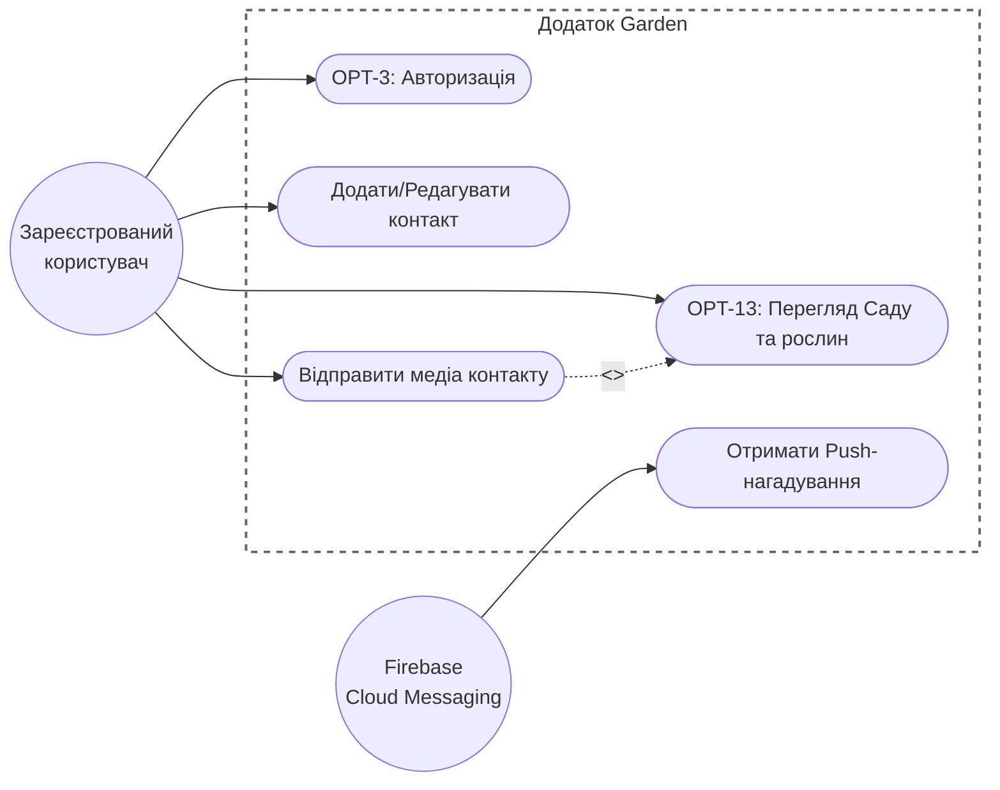
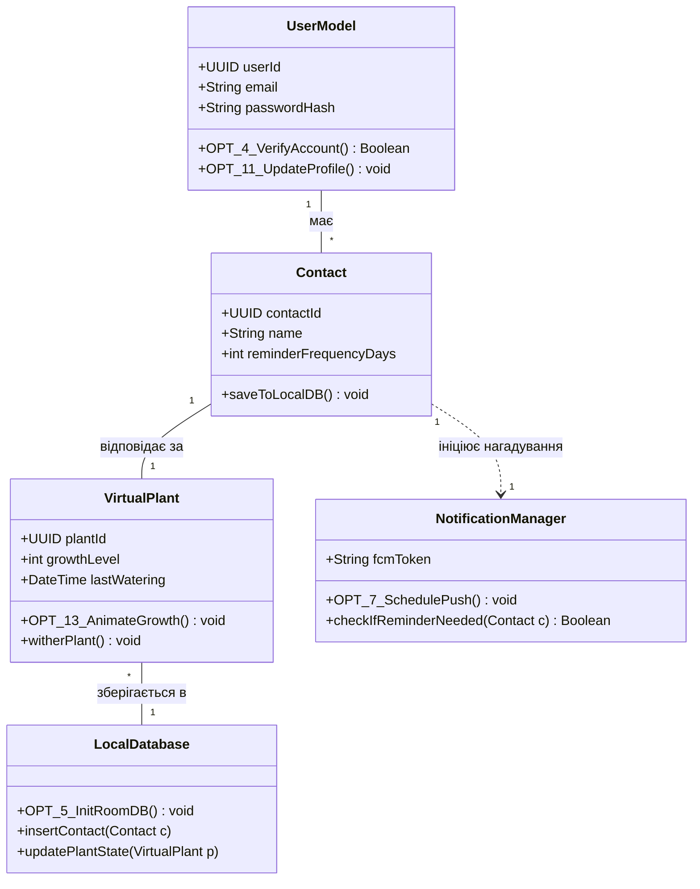
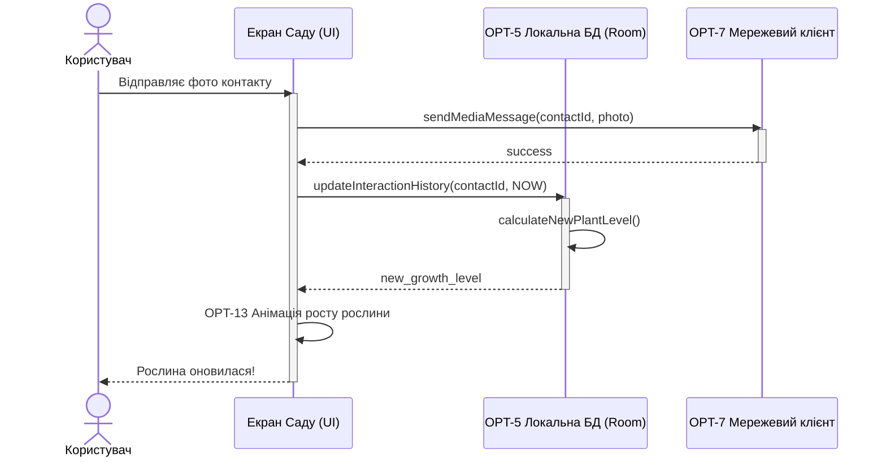

# Лабораторна робота: Проєктування архітектури застосунку

### Крок 1. Опис проєкту
**Назва проєкту:** "Garden" 
**Опис:** Мобільний застосунок для підтримки особистих стосунків з рідними та близькими людьми. Головна метафора застосунку — віртуальний «Сад», де кожна окрема рослина відповідає одному контакту. Застосунок вирішує проблему підтримки зв'язків без тиску та шеймінгу.

### Крок 2. Функціональні вимоги
*Вимоги базуються на специфікації (SRS) та беклогу Jira.*
* **FR-01 (Реєстрація):** Система дозволяє реєстрацію через електронну пошту та пароль (задачі OPT-3, OPT-4).
* **FR-02 (Контакти та БД):** Користувач може додавати контакти, які зберігаються у локальній базі даних пристрою (задача OPT-5, обмеження C-02).
* **FR-03 (Сад та Анімації):** Застосунок відображає віртуальний «Сад», де рослина збільшується та стає яскравішою при регулярному спілкуванні (задачі OPT-13, OPT-14, вимога FR-05/FR-06).
* **FR-04 (Нагадування):** Система надсилає не більше одного push-нагадування на добу на кожен контакт через FCM (задачі OPT-7, OPT-8).
* **FR-05 (Відправка медіа):** Користувач може надіслати картинку контакту безпосередньо із застосунку (вимога FR-08).

### Крок 3. Діаграма прецедентів (Use Case Diagram)(Кирило Федоров)

### Крок 4. Діаграма класів (Class Diagram)(Михайло Павленко)

### Крок 5. Діаграма послідовності (Sequence Diagram)(Іван Гордієнко, Владислав Кисіль)

### Матриця відстежуваності (SRS)

| Вимога | Джерело | Тест-критерій |
| :--- | :--- | :--- |
| **FR-01** | «Чи обов'язкова реєстрація...?» | Успішна реєстрація нового email + вхід |
| **FR-02** | «Які функції повинна мати програма?» | Додавання контакту без номера телефону |
| **FR-03** | «Індивідуальний підхід до контактів» | Різна частота нагадувань для двох контактів |
| **FR-04** | «Що таке неагресивне нагадування?» | Не більше 1 push за 24 год на контакт |
| **FR-05, 06, 07** | «Чому обрати саме ваш продукт?» | Рослина росте після взаємодії; в'яне після N днів |
| **FR-08** | «Які функції повинна мати програма?» | Успішна відправка тестової картинки |
| **FR-09** | «Які функції повинна мати програма?» | Видалення контакту — рослина зникає з саду |
| **FR-10** | «Які функції повинна мати програма?» | Повідомлення відображається в історії контакту |
| **NFR-P-01** | «Яке допустиме time-to-response?» | JMeter: 95% запитів < 1.5 с |
| **NFR-SC-01** | «Яке навантаження на сервери?» | JMeter/Gatling: імітація 500 000 підключень |

### Крок 6. Матриця трасовності(Кирило Федоров, Михайло Павленко, Іван Гордієнко, Владислав  Кисіль)

| ID вимоги | Задачі в Jira | Прецедент (Use Case) | Задіяні класи | Діаграма послідовності |
| :--- | :--- | :--- | :--- | :--- |
| **FR-01** | OPT-3, OPT-4 | Авторизація | `UserModel` | Ні |
| **FR-02** | OPT-5 | Додати/Редагувати контакт | `Contact`, `LocalDatabase` | Ні |
| **FR-03** | OPT-13, OPT-14 | Перегляд Саду та рослин | `VirtualPlant` | **Так** |
| **FR-04** | OPT-7, OPT-8 | Отримати Push-нагадування | `NotificationManager` | Ні |
| **FR-05** | OPT-7 | Відправити медіа контакту | `Contact`, `LocalDatabase` | **Так** |
