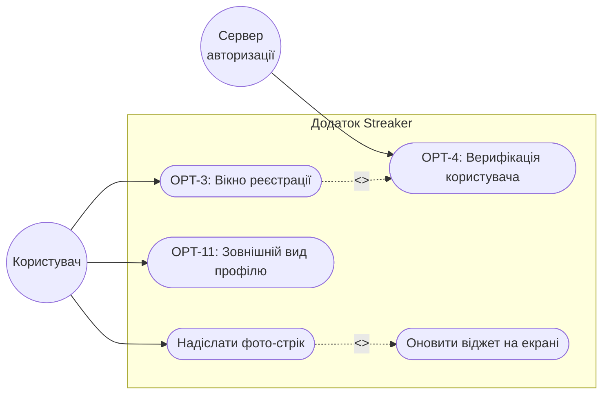
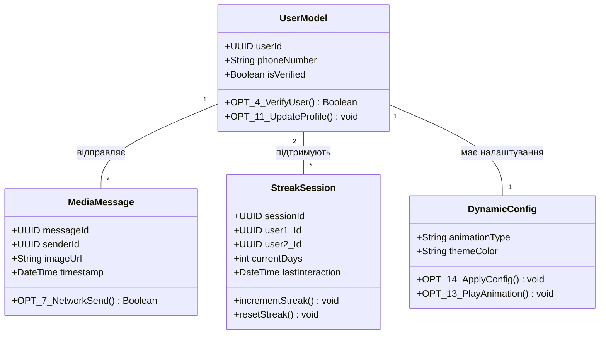

# Лабораторна робота: Проєктування архітектури застосунку

### Крок 1. Опис проєкту
**Назва проєкту:** "Streaker" 
**Опис:** Мобільний клієнт-серверний застосунок для Android, націлений на підтримання щоденного спілкування між близькими людьми (формат "стріків") за допомогою обміну фотографіями через віджет на головному екрані.

### Крок 2. Функціональні вимоги
* **FR-01 (Реєстрація):** Система повинна надавати інтерфейс для реєстрації користувача та проводити його верифікацію (задачі OPT-3, OPT-4).
* **FR-02 (Профіль):** Користувач повинен мати можливість налаштувати зовнішній вигляд свого профілю (задача OPT-11).
* **FR-03 (Мережева комунікація):** Система повинна передавати медіафайли між клієнтом та сервером за визначеним мережевим протоколом (задача OPT-7).
* **FR-04 (База даних):** Серверна частина повинна зберігати користувачів, повідомлення та стан "стріків" у реляційній базі даних (задача OPT-5).
* **FR-05 (Динамічна конфігурація):** Система повинна автоматично оновлювати стан віджета з використанням анімацій при надходженні нових даних (задачі OPT-13, OPT-14).

### Крок 3. Діаграма прецедентів (Use Case Diagram)

