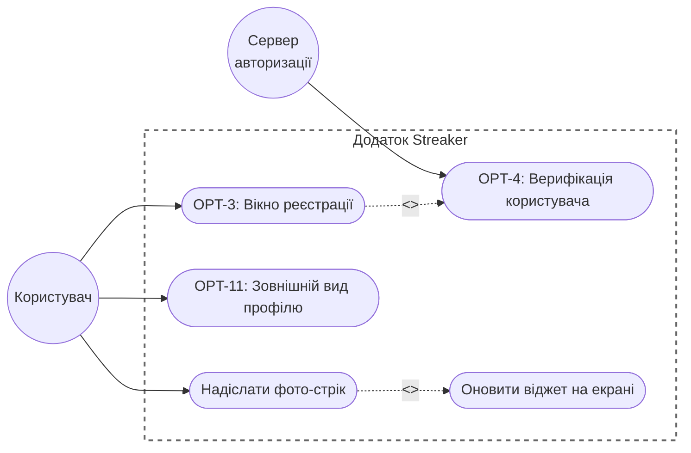
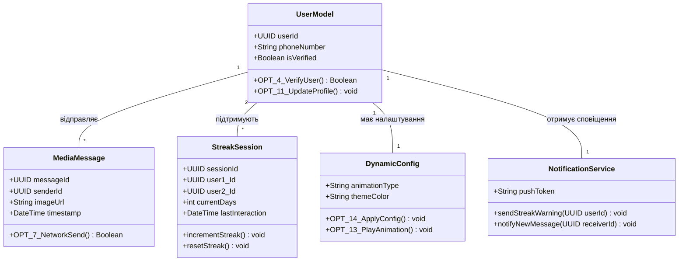
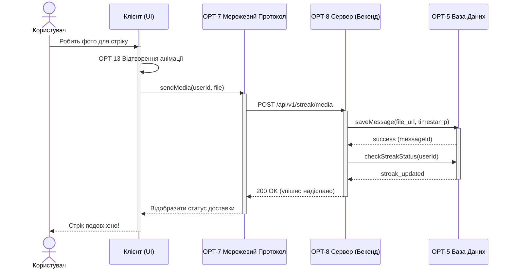

# Лабораторна робота: Проєктування архітектури застосунку

### Крок 1. Опис проєкту
**Назва проєкту:** "Streaker" 
**Опис:** Мобільний клієнт-серверний застосунок для Android, націлений на підтримання щоденного спілкування між близькими людьми (формат "стріків") за допомогою обміну фотографіями через віджет на головному екрані.

### Крок 2. Функціональні вимоги
* **FR-01 (Реєстрація):** Система повинна надавати інтерфейс для реєстрації користувача та проводити його верифікацію (задачі OPT-3, OPT-4).
* **FR-02 (Профіль):** Користувач повинен мати можливість налаштувати зовнішній вигляд свого профілю (задача OPT-11).
* **FR-03 (Мережева комунікація):** Система повинна передавати медіафайли між клієнтом та сервером за визначеним мережевим протоколом (задача OPT-7).
* **FR-04 (База даних):** Серверна частина повинна зберігати користувачів, повідомлення та стан "стріків" у реляційній базі даних (задача OPT-5).
* **FR-05 (Динамічна конфігурація):** Система повинна автоматично оновлювати стан віджета з використанням анімацій при надходженні нових даних (задачі OPT-13, OPT-14).

### Крок 3. Діаграма прецедентів (Use Case Diagram)

### Крок 4. Діаграма класів (Class Diagram)

### Крок 5. Діаграма послідовності (Sequence Diagram)

### Крок 6. Матриця трасовності

| ID вимоги | Задачі в Jira | Прецедент (Use Case) | Задіяні класи (OPT-5) | Діаграма послідовності |
| :--- | :--- | :--- | :--- | :--- |
| **FR-01** | OPT-3, OPT-4 | Вікно реєстрації, Верифікація | `UserModel` | Ні |
| **FR-02** | OPT-11 | Зовнішній вид профілю | `UserModel` | Ні |
| **FR-03** | OPT-7, OPT-8 | Надіслати фото-стрік | `MediaMessage` | **Так (OPT-7)** |
| **FR-04** | OPT-5 | Усі (Основа системи) | `StreakSession`, `UserModel` | **Так (DB збереження)** |
| **FR-05** | OPT-13, OPT-14 | Оновити віджет на екрані | `DynamicConfig` | Ні |
